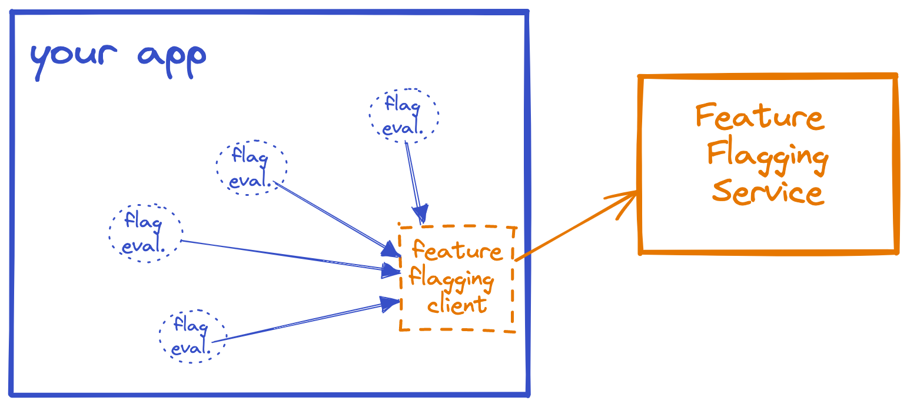
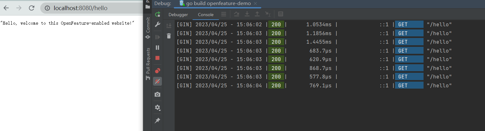

# open-feature quickstart

OpenFeature 是一个开放标准，它提供了一个与供应商无关、社区驱动的 API，用于功能标记，可与您最喜欢的功能标记管理工具一起使用。

OpenFeature 提供了一个共享的、标准化的功能标记客户端——一个 SDK——可以插入各种第 3 方功能标记提供程序。
无论您使用的是开源系统还是商业产品，无论是自托管还是云托管，OpenFeature 都为开发人员提供一致、统一的 API，以便在他们的应用程序中使用Feature flags。

Feature flags是动态的；它们在运行时进行评估。在生产过程中，您可以逐渐向更多用户推出一项功能，而无需重新部署或重启任何东西。

鉴于所有这些要求（连同其他要求，例如管理 UI、审计跟踪、环境管理等），很明显，充分使用Feature flags需要一个功能标记系统——通常是一个独立的功能标记服务和一个客户端与该服务交互的库。

一个典型的feature-flagging system 如下：



以下是一个使用 OpenFeature 进行功能标记的快速demo，它可以通过在不改动业务代码的情况下，动态改变接口的返回值。

## 环境准备

1.本地或使用 docker 启动 go-feature-flag的 [relayproxy](https://github.com/thomaspoignant/go-feature-flag)

如果是 docker 启动，按照如下步骤操作：

首先是准备两个配置文件，一个是 relayproxy 的启动文件(goff-proxy.yaml)，一个的 flag配置文件(flag-config.yaml)。

goff-proxy.yaml
```yaml
listen: 1031
pollingInterval: 1000
startWithRetrieverError: false
retriever:
  kind: file
  path: /goff/flag-config.yaml
exporter:
  kind: log
```

flag-config.yaml
```yaml
test-flag:
  variations:
    my-new-feature: true
    my-old-feature: false
  defaultRule:
    percentage:
      my-new-feature: 100
      my-old-feature: 0
```

docker 启动命令：

```sh
docker run \        
  -p 1031:1031 \
  -v $(pwd)/flag-config.yaml:/goff/flag-config.yaml \
  -v $(pwd)/goff-proxy.yaml:/goff/goff-proxy.yaml \
  thomaspoignant/go-feature-flag-relay-proxy:latest
```

启动日志：

```sh
█▀▀ █▀█   █▀▀ █▀▀ ▄▀█ ▀█▀ █ █ █▀█ █▀▀   █▀▀ █   ▄▀█ █▀▀
█▄█ █▄█   █▀  ██▄ █▀█  █  █▄█ █▀▄ ██▄   █▀  █▄▄ █▀█ █▄█

     █▀█ █▀▀ █   ▄▀█ █▄█   █▀█ █▀█ █▀█ ▀▄▀ █▄█
     █▀▄ ██▄ █▄▄ █▀█  █    █▀▀ █▀▄ █▄█ █ █  █ 

GO Feature Flag Relay Proxy
_____________________________________________
{"level":"info","ts":1682402394.6320636,"caller":"fflog/log.go:14","msg":"[2023-04-25T05:59:54Z] flag test-flag added"}
{"level":"info","ts":1682402394.6327896,"caller":"api/server.go:111","msg":"Starting go-feature-flag relay proxy ...","address":"0.0.0.0:1031","version":"1.8.2"}
{"level":"info","ts":1682402397.4835746,"caller":"logsexporter/exporter.go:51","msg":"[2023-04-25T05:59:57Z] user=\"a\", flag=\"test-flag\", value=\"true\""}
```

替换 ${relayproxy节点IP} 为 你实际IP:
```go
options := gofeatureflag.ProviderOptions{
			Endpoint: "http://${relayproxy节点IP}:1031",
			HTTPClient: &http.Client{
				Timeout: 1 * time.Second,
			},
		}
```

## 访问




## Reference

[openfeature_go](https://gofeatureflag.org/docs/openfeature_sdk/openfeature_go)

[Getting Started with the OpenFeature Go SDK and Go Gin](https://openfeature.dev/docs/tutorials/getting-started/go)

[thomaspoignant / go-feature-flag](https://github.com/thomaspoignant/go-feature-flag)

